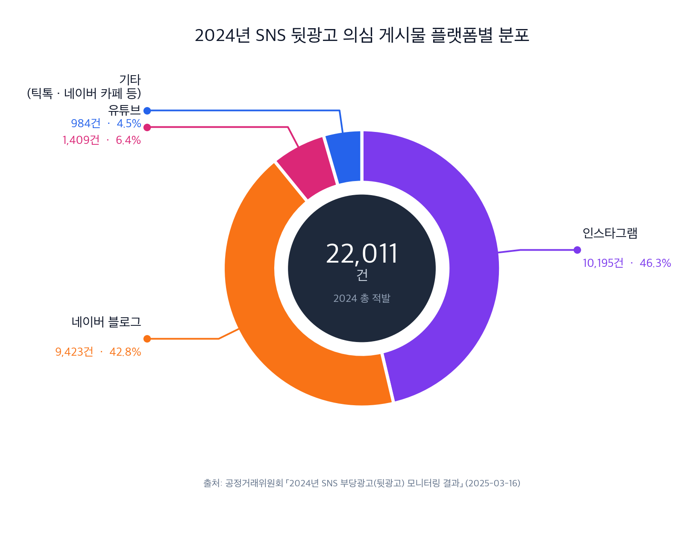

# 1. 문제 정의

> **주제**: **숏폼 동영상 광고(YouTube Shorts · Instagram Reels · TikTok)** 에서 노출되는 **건강기능식품·화장품·다이어트 등 규제 민감 카테고리**의 이커머스 상품 광고에서 발생하는 **허위·과장 표현**을 **소비자**가 실시간으로 판별할 수 있도록 돕는다.

> **범위 요약**
> - **주 타겟 사용자**: 일반 소비자 (B2C, 사용자용 도구)
> - **플랫폼**: YouTube Shorts · Instagram Reels · TikTok
> - **상품 카테고리**: 건강기능식품 · 화장품 · 다이어트 제품 등 표시광고법·식약처 규제가 엄격한 영역
> - **AI 기술 축**: 영상·이미지 Vision + 자막·카피 NLP/LLM + 멀티모달 교차검증
> - **개입 시점**: 사용자 능동 호출 — 의심 영상을 _공유 시트(Share Sheet)_ 로 앱에 보냈을 때 분석·리포트
> - **서비스 폼팩터**: iOS · Android 모바일 앱 + OS 공유 시트 연동

---

## 1.1 산업·도메인 배경

### 1.1.1 이커머스 시장
- 국내 온라인쇼핑 거래액은 통계청 온라인쇼핑동향 기준 <mark>2024년 약 259조 원 → 2025년 272조 398억 원 (전년 대비 4.9%↑)</mark> 으로 성장세를 유지하고 있다[^stat-ecomm].
- 이커머스 광고 시장도 동반 팽창하며, **노출 채널이 포털·앱 내부에서 외부 소셜·동영상 플랫폼(숏폼)으로 빠르게 이동**하고 있다.

### 1.1.2 숏폼 동영상 — 이커머스 광고의 새로운 주력 채널
- YouTube Shorts · Instagram Reels · TikTok 등 **15~60초 세로형 동영상** 포맷이 2020년 전후 대중화기를 지나 이후 주류화되었다.
- 컨슈머인사이트 2025년 이동통신 기획조사에 따르면 <mark>국내 이용자는 숏폼을 한 번 보기 시작하면 평균 21분간 연속 시청</mark>하며, 스마트폰·태블릿 영상 시청 시간의 주요 소비 형태가 되었다 (하루 평균 97분)[^stat-shortform].
- <mark>10~30대에서 이미 주력 콘텐츠 장르</mark>로 자리 잡았고, 유튜브 쇼츠·인스타그램 릴스가 시장을 주도한다[^stat-shortform].
- 알고리즘 자동 피드(swipe-to-next)로 **광고–콘텐츠 경계가 희미해진 네이티브 광고** 형태가 주류가 되었다.
- 글로벌 광고주·인플루언서·중소 셀러 모두 **상품 판매 링크(커머스 핀, in-bio link, 바로결제)** 를 영상에 연결하면서, 사실상 _숏폼 = 이커머스 진입점_ 으로 기능한다.

### 1.1.3 허위·과장 광고의 구조적 악화
- 공정거래위원회가 2025년 3월 발표한 **2024년 SNS 부당광고(뒷광고) 모니터링 결과** 기준, <mark>연간 뒷광고 의심 게시물 22,011건 적발, 26,033건 시정</mark>이 이루어졌다[^stat-stealth].
  - 플랫폼별: 인스타그램 10,195건 · 네이버 블로그 9,423건 · 유튜브 1,409건 · 기타(틱톡·네이버 카페 등) 984건[^stat-stealth].
  - 주요 위반 유형: **"표시위치 부적절"(73.9%)** — 광고 고지가 모바일 `더보기` 영역에 가려진 사례가 대부분[^stat-stealth].
  > ⚠️ "뒷광고(stealth ad)"는 _광고임을 고지하지 않은 게시물_ 위주 통계로, 본 프로젝트의 핵심 관심사인 **허위·과장 광고(false/exaggerated advertising)** 와는 법적 구성요건이 다르다. 다만 숏폼·SNS 광고 신뢰 훼손의 규모를 가늠하는 **1차 대리 지표(proxy)** 로 활용한다.
- 공정위는 별도로 온라인 할인율 거짓·과장 표시광고 행위에 대해 최근 3년간 **8건 직권조사**를 통해 과징금·시정명령을 부과해 왔다[^stat-ftc-discount].
- 실제 허위·과장 광고는 다음 카테고리에서 빈발한다.
  - 건강기능식품 · 화장품 · 다이어트 제품
  - 의료기기 유사품 · 미용기기
  - 가전·디지털 (스펙 과장, 호환성 허위)
  - 해외 직구 · 드롭쉬핑 상품
- 2024~2025년 **생성형 AI 확산**으로 광고 영상·이미지·카피가 대량 제작되어, 허위·과장 광고의 _생성 속도·품질·설득력_ 이 질적으로 변화하고 있다.

## 1.2 해결하고자 하는 문제

- **문제 한 줄**
  > **일반 소비자**는 YouTube Shorts · Instagram Reels · TikTok 피드에서 빠르게 스쳐 지나가는 건강기능식품·화장품·다이어트 상품 광고 속 **영상·자막·주장 중 어떤 부분이 허위 또는 과장인지 실시간으로 판별할 수 없다.**

- **숏폼 광고에서 자주 나타나는 허위·과장 유형**

  | 유형 | 숏폼에서의 구현 방식 |
  |------|---------------------|
  | 효능·효과 과장 | "2주 만에 X kg 감량", "피부 즉시 변화" 등을 **편집·자막·연출**로 극적 시연 |
  | 이미지·영상 조작 | Before/After **영상 합성**, 각도·조명·필터로 시연 결과 과장 |
  | 권위 사칭·딥페이크 | 연예인·의사·전문가 얼굴·음성 **AI 합성** 또는 무단 편집 |
  | 가짜 체험담 | 배우·지인이 연기한 **가짜 사용자 리뷰 영상** |
  | 심리 조작 | "오늘만", "마감 임박" **카운트다운 자막** 반복 노출 |
  | 가격·수량 허위 | 정상가 부풀린 뒤 할인율 표기, "단 100개" 상시 표기 |
  | 링크 미스리딩 | 영상은 국내 브랜드처럼 보이나 링크는 **해외 드롭쉬핑 저품질 몰** |
  | AI 생성 광고 | AI 이미지·AI 음성·AI 카피로 대량 제작된 **실물 없는 상품** 광고 |

- **문제의 빈도·강도**
  - 공정위 2024년 SNS 부당광고 모니터링 — 의심 게시물 <mark>22,011건 적발 / 시정 26,033건</mark> (1.5 근거·통계 참조)[^stat-stealth].
  - 표시광고법 위반 연간 적발·유형별 분포 — _보강 필요: 공정위 통계연보 수치_
  - 한국소비자원 민원 중 SNS·숏폼 광고 관련 비중 및 1인당 피해액 — _보강 필요_
  - 팀 자체 샘플링 — 숏폼 플랫폼 3종에서 건기식·화장품·다이어트 광고 **N건 수집 후 유형별 분류 예정** (데이터셋 구축 계획은 §4에서 확정)

## 1.3 문제 발생 맥락

- **소비자 인지 관점** — 숏폼은 한 영상당 **15~60초** 길이로 빠르게 전환되며, 한 번 보기 시작하면 <mark>평균 21분간 연속 시청</mark>하는 **플로우(flow) 소비** 형태다[^stat-shortform]. 스와이프 관성에 의해 비판적 판단 전 다음 영상으로 이동하므로, 일반 이커머스 광고보다도 진위 검증 여유가 구조적으로 부족하다.
- **형식의 기만성** — 숏폼 광고는 **일반 크리에이터 콘텐츠와 시각적으로 구분이 어렵다**. "광고" 고지가 눈에 띄지 않거나, 인플루언서 후기처럼 포장된다.
- **플랫폼 검수 한계** — YouTube·Meta·TikTok은 **일일 수백만 건**의 광고를 자동 심사에 의존하며, 한국어 시장·한국 법령에 특화된 검수가 약하다. 텍스트 필터로는 영상·음성 속 주장 검증이 불가능.
- **제재의 사후성** — 공정위 시정조치는 **이미 유통·구매가 일어난 후** 작동. 숏폼의 **휘발성(24~72시간 내 노출 효과 집중)** 과 법적 절차 속도가 구조적으로 불일치.
- **현재의 우회적 대처**
  - 소비자: 댓글·외부 검색·커뮤니티 후기 의존 → 영상이 지나간 뒤엔 재탐색 비용 큼
  - 플랫폼: 키워드·신고 기반 자동화, 광고주 자진 준수 가이드 → 커버리지 한계
  - 규제기관: 모니터링 요원·언론·민원 기반 단속 → 속도·범위 모두 부족

## 1.4 주제 선택 이유

1. **시급성과 시의성** — 숏폼 광고 침투율 급증 + 생성형 AI 광고 폭증이 겹친 _2025년의 전형적 사회 문제_. "AI가 만든 문제는 AI로 풀어야 하는" 정당한 과제.
2. **다면 가치** — 소비자(피해 방지) · 플랫폼(운영 리스크 저감) · 규제기관(모니터링 자동화) · 정직한 셀러(공정경쟁 회복) 4주체 모두에게 가치가 있다.
3. **AI 기술 정당성** — 숏폼 광고 분석은 본질적으로 **멀티모달 AI** 문제다. 본 프로젝트에서는 다음 3축으로 구성한다.
   - **Vision / Video Understanding** — Before/After 합성 탐지, 연예인·전문가 딥페이크 탐지, 장면·객체 분석
   - **NLP / LLM** — 자막·카피·설명란 텍스트에서 claim 추출 → **표시광고법·식약처 허용 표현 DB** 와 맵핑하여 위반 유형 분류
   - **멀티모달 교차검증** — 영상 장면 ↔ 자막·카피 ↔ 랜딩페이지 상세정보 ↔ 상품DB의 **정합성 검증**
   → 룰·CRUD·키워드 필터로는 풀 수 없는 구조적 문제.
4. **도메인 좌표** — `research/01_domain_definition.md` 기준 **L4(광고·마케팅) × L6(의사결정 지원)** 교차점. 1차 이해관계자는 **소비자**, 2차로 플랫폼·규제기관에 가치 확장 가능.
5. **학습 프로젝트 적합성** — 공개 데이터(광고 영상, 공정위 시정조치 내역, 상품 정보)와 자체 크롤링·합성으로 학습 데이터 구성이 합리적으로 가능. 브라우저 확장·앱 프로토타입 형태로 **발표 시 데모 임팩트 강력**.

## 1.5 근거·통계

### 1.5.1 핵심 통계 요약

| 지표 | 수치 | 출처 |
|------|------|------|
| 국내 온라인쇼핑 연간 거래액 (2025) | <mark>272조 398억 원</mark> (전년 대비 4.9%↑) | 통계청 온라인쇼핑동향[^stat-ecomm] |
| 국내 온라인쇼핑 연간 거래액 (2024) | 약 259조 원 | 통계청 온라인쇼핑동향[^stat-ecomm] |
| 숏폼 연속 시청 평균 시간 (2025, 1회 세션) | <mark>21분</mark> | 컨슈머인사이트 Telecom Report '25-14[^stat-shortform] |
| 스마트폰·태블릿 영상 시청 시간 (2025) | 하루 평균 97분 | 컨슈머인사이트 Telecom Report '25-14[^stat-shortform] |
| SNS 뒷광고 의심 게시물 적발 (2024) | <mark>22,011건</mark> / 시정 26,033건 | 공정위 SNS 부당광고 모니터링[^stat-stealth] |
| 뒷광고 주요 위반 유형 (인스타그램) | "표시위치 부적절" 73.9% | 공정위 SNS 부당광고 모니터링[^stat-stealth] |

### 1.5.2 2024년 SNS 뒷광고 적발 — 플랫폼 분포

생성 스크립트: [`scripts/make_platform_pie.py`](../../scripts/make_platform_pie.py) — `uv run scripts/make_platform_pie.py` 로 재생성 가능

> _참고_: 본 차트는 "뒷광고(광고 미고지)" 기준 통계로, 본 프로젝트가 다루는 _허위·과장 광고_ 와 법적 구성요건은 다르지만, 숏폼·SNS에서 광고 신뢰 훼손의 규모·분포를 가늠하는 1차 지표로 사용한다.

### 1.5.3 보강 필요 항목

| 주장 | 필요 근거 | 예상 출처 | 담당 | 상태 |
|------|----------|-----------|------|------|
| 표시광고법 위반 연간 적발·유형 분포 | 연간보고서 공식 수치 | 공정거래위원회 통계연보 | _TODO_ | ☐ |
| 건기식·화장품 표시광고 위반 실태 | 카테고리별 위반 건수 | 식약처 · 공정위 | _TODO_ | ☐ |
| 소비자 피해 규모 (1인 평균 피해액) | 민원 건수·피해액 | 한국소비자원 피해구제 통계 | _TODO_ | ☐ |
| 생성형 AI 광고 증가 추이 | 탐지·단속 사례 | KISA · 업계 리포트 | _TODO_ | ☐ |
| 팀 자체 샘플링 데이터셋 | 숏폼 광고 N건 수집·유형 분류 | 팀 자체 수집 | _TODO_ | ☐ |

---

### 출처 (References)

[^stat-ecomm]: 통계청 「온라인쇼핑동향조사」 — <https://mods.go.kr/statDesc.es?act=view&mid=a10501010000&sttr_cd=S009007>. 2024년 12월 및 연간 온라인쇼핑동향 요약 (KDI 경제교육·정보센터): <https://eiec.kdi.re.kr/policy/materialView.do?num=262891>. 접속일 2026-04-18.

[^stat-shortform]: 컨슈머인사이트 「숏폼 한번 보면 평균 21분, 4명 중 3명 유튜브로 본다」, Telecom Report '25-14 (2025-08-14) — <https://www.consumerinsight.co.kr/>. 접속일 2026-04-18.

[^stat-stealth]: 공정거래위원회 「2024년 SNS 부당광고(뒷광고) 모니터링 결과 발표」 (2025-03-16, 대한민국 정책브리핑) — <https://www.korea.kr/briefing/pressReleaseView.do?newsId=156679064>. KDI 요약: <https://eiec.kdi.re.kr/policy/materialView.do?num=264360>. 접속일 2026-04-18.

[^stat-ftc-discount]: 대한민국 정책브리핑 「공정위 "온라인 할인율 거짓·과장 표시광고 엄중 조치 중"」 — <https://www.korea.kr/news/policyNewsView.do?newsId=148952606>. 접속일 2026-04-18.

---

## 📌 범위 확정 현황

- [x] **주 타겟 사용자** — 일반 소비자 (B2C, 사용자용 도구)
- [x] **플랫폼 범위** — YouTube Shorts + Instagram Reels + TikTok
- [x] **광고주·상품 범위** — 건강기능식품 · 화장품 · 다이어트 등 **규제 민감 카테고리 집중**
- [x] **AI 탐지 기술 축** — 영상·이미지 Vision + 자막·카피 NLP/LLM + 멀티모달 교차검증 (음성 ASR은 1차 범위 제외)
- [x] **서비스 개입 시점** — 사용자 능동 호출 (의심 영상을 공유 시트로 전송 시 분석)
- [x] **서비스 폼팩터** — iOS · Android 모바일 앱 + OS 공유 시트 연동

→ 본 섹션의 범위 기반으로 `02_target_users.md` (페르소나)와 `03_service_overview.md` (서비스 개요·차별점) 작성으로 이어진다.
