# 1. 문제 정의

본 섹션은 이커머스 시장의 팽창과 광고 채널의 진화를 추적하여, 그 끝에서 우리가 풀어야 할 **문제**를 정의한다.

---

## 1.1 산업·도메인 배경

### 1.1.0 이커머스란 무엇인가 — 정의와 국내 산업 분류

**이커머스(e-commerce)** 는 인터넷·모바일 등 <mark>**디지털 채널을 매개로 상품 또는 서비스를 거래하는 모든 상행위**</mark>를 말한다. 협의로는 _주문·결제_ 라는 거래 사건 자체를 의미하지만, 실제 산업은 **상품 기획 → 콘텐츠 제작 → 검색·노출 → 광고·마케팅 → 구매·결제 → 배송·CS → 리뷰·재구매**로 이어지는 <mark>**전 가치사슬(end-to-end value chain)**</mark>을 포괄한다.

국내 이커머스는 거래 주체와 채널 형태에 따라 다음과 같이 분류된다.

| 분류 축 | 유형 | 대표 사례 |
|---------|------|-----------|
| 거래 주체 | <mark>**B2C** (기업 → 소비자)</mark> | 쿠팡 · 11번가 · 아마존 |
| | **B2B** (기업 간) | 알리바바(Alibaba.com) · 쿠팡 비즈니스 |
| | **C2C** (개인 간) | 당근 · 번개장터 |
| | <mark>**B2B2C** (플랫폼 중개)</mark> | 네이버 스마트스토어 · 무신사 |
| 채널 형태 | 종합몰 · 전문몰(버티컬) · **라이브커머스** · **숏폼 커머스** | 쿠팡 · 무신사 · 네이버 쇼핑라이브 · 유튜브 쇼핑·인스타 쇼핑 |

### 1.1.1 이커머스 시장 규모 — 6년간 2배 성장

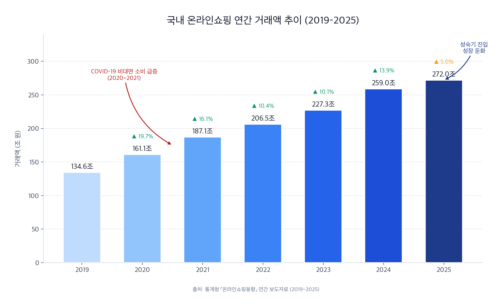

- 국내 온라인쇼핑 거래액은 <mark>2019년 134.6조 원에서 2025년 272.0조 원까지 약 2배 성장</mark>했다[^stat-ecomm].
- **COVID-19 시기(2020~2021)** 에 비대면 소비 급증으로 두 자릿수 성장을 2년 연속 기록한 이후, 성숙기에 진입하며 2025년 전년 대비 성장률은 <mark>5% 수준으로 둔화</mark>되었다.
- 그러나 **절대 거래 규모**가 꾸준히 커지면서 광고 지출도 비례해 증가한다. 커진 파이를 두고 광고주들은 더 공격적인 노출 채널을 찾게 되며, 여기서 **채널 이동의 압력**이 발생한다.

### 1.1.2 광고 채널의 시대적 진화 — 포털 → 소셜 → 모바일 → 숏폼·AI

국내 디지털 광고 채널은 약 30년간 네 단계로 진화해왔다. 각 전환의 공통 동인은 **사용자 체류 시간의 이동**이다.

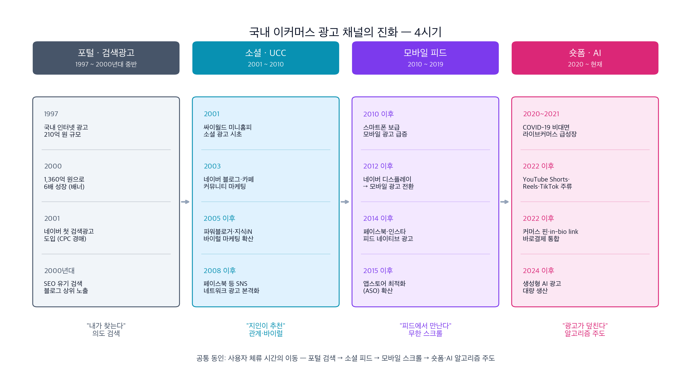

**각 전환의 본질**

| 단계 | 주도 동인 | 대표 광고 형식 | 공급 측 변화 |
|------|-----------|----------------|--------------|
| **포털·검색광고** (2001) | 의도 검색 ("내가 찾는다") | 배너 · **CPC 검색광고 · SEO 상위 노출** | 오버추어 → 네이버 파워링크 경매 개시 |
| **소셜·UCC** (2005) | 관계·바이럴 ("지인이 추천") | 블로그·카페 후기 · **파워블로거 바이럴** | 인플루언서 섭외 · 지식iN 답변 마케팅 |
| **모바일 피드** (2014) | 피드 소비 ("무한 스크롤") | 피드 네이티브 광고 · ASO | 타겟팅 정교화 · 앱 생태계 편입 |
| **숏폼·AI** (2020) | **알고리즘 주도 ("광고가 덮친다")** | **15~60초 영상 · 네이티브 인스트림** | <mark>**AI 생성으로 극단적 비용 절감**</mark> |

숏폼 단계에 와서는 사용자가 _광고를 찾는_ 것이 아니라 <mark>**_광고가 사용자를 덮치는_ 구조**</mark>가 되었다. 플랫폼은 알고리즘으로 광고–콘텐츠 경계를 흐리고, 광고주는 인플루언서·AI로 광고 제작 비용을 극단적으로 낮춘다. <mark>**이 변화가 본 프로젝트가 겨냥하는 허위·과장 광고 확산의 토양이다.**</mark>

### 1.1.3 숏폼은 광고 채널을 넘어 '이커머스 거래 진입점'이 되었다

**핵심 변화** — 숏폼은 단순 광고 노출 매체가 아니라, **인지 → 관심 → 결정 → 결제가 한 영상 안에서 완결되는 압축 구매 퍼널(compressed funnel)** 이다. 전통 이커머스의 "검색 → 쇼핑몰 → 비교 → 결제" 다단계가 <mark>**수 클릭 이내**</mark>로 단축된다.

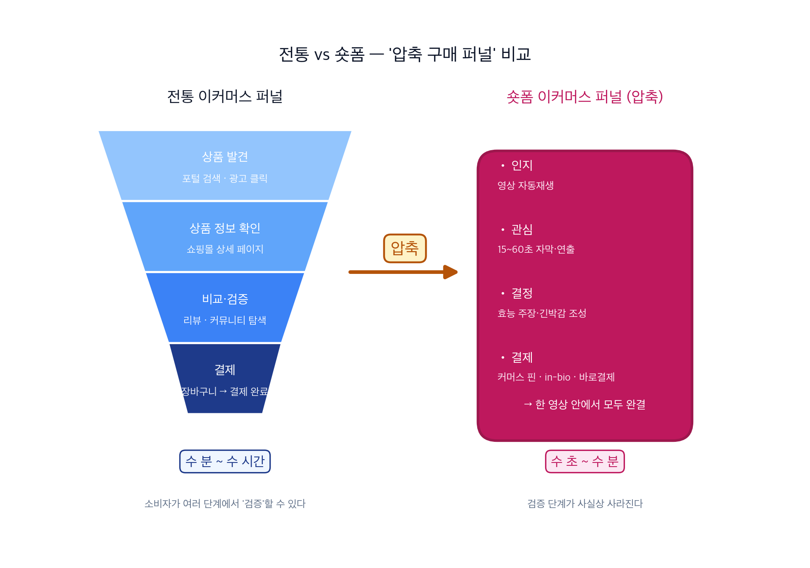

> 🔑 **핵심 용어 해설**
> - **커머스 핀 (Commerce Pin)** — 영상·게시물 위에 상품을 태그하여 **탭 한 번으로 상세·결제로 이동**시키는 기능 (Instagram Shop · Pinterest 등).
> - **in-bio link** — 프로필(bio) 영역에 여러 상품 링크를 모아두는 방식 (Linktree 류). 영상 마지막에 _"프로필 링크 참고"_ 문구로 유도.
> - **바로결제** — 애플페이·네이버페이·카드 간편결제로 **상세페이지 경로 없이 단일 클릭 결제** 완료.

#### 전통 퍼널 vs 숏폼 퍼널 비교

| 전환 지점 | 전통 이커머스 | 숏폼 이커머스 |
|-----------|---------------|---------------|
| 상품 발견 | 포털 검색 · 광고 클릭 | 피드 스크롤 중 자동재생 |
| 상품 정보 | 쇼핑몰 상세 페이지 | **영상 자체 (15~60초)** |
| 비교·검증 | 리뷰 · 커뮤니티 탐색 | 거의 없음 (플로우 소비) |
| 구매 경로 | 장바구니 → 결제 | **커머스 핀 · in-bio · 바로결제** |
| 전환 시간 | 수 분 ~ 수 시간 | <mark>**수 초 ~ 수 분**</mark> |

#### 소비 저변 — 10~30대를 넘어 전 연령대로 확장

- **숏폼 세션** — 한 번 보기 시작하면 평균 <mark>21분 연속 시청</mark>, 하루 평균 <mark>97분</mark> 모바일 영상 소비[^stat-shortform].
- **10~30대** — 컨슈머인사이트 조사 기준 **10대는 전 세대 중 유일하게 숏폼을 가장 선호하는 콘텐츠 형태**로 답했고[^stat-shortform], 본 §1.1.3 도입부에서 정의한 **압축 구매 퍼널(상품 발견 → 결제 < 수 분)** 의 주력 진입점도 이 세대에서 가장 활발하게 작동한다.
- **영상 기반 소비는 10~30대를 넘어 전 연령대로 확장**되고 있으며, 특히 고연령층에서 유튜브가 주력 정보 소비 창구로 자리잡았다 — 아래 한국언론진흥재단 2024 차트[^stat-kpf-sns]가 그 증거다.
- **뉴스·시사 정보를 유튜브로 얻는 비율은 연령이 올라갈수록 가파르게 상승**한다 — 한국언론진흥재단 2024 소셜미디어 이용자 조사 기준[^stat-kpf-sns] (아래 차트 참조).

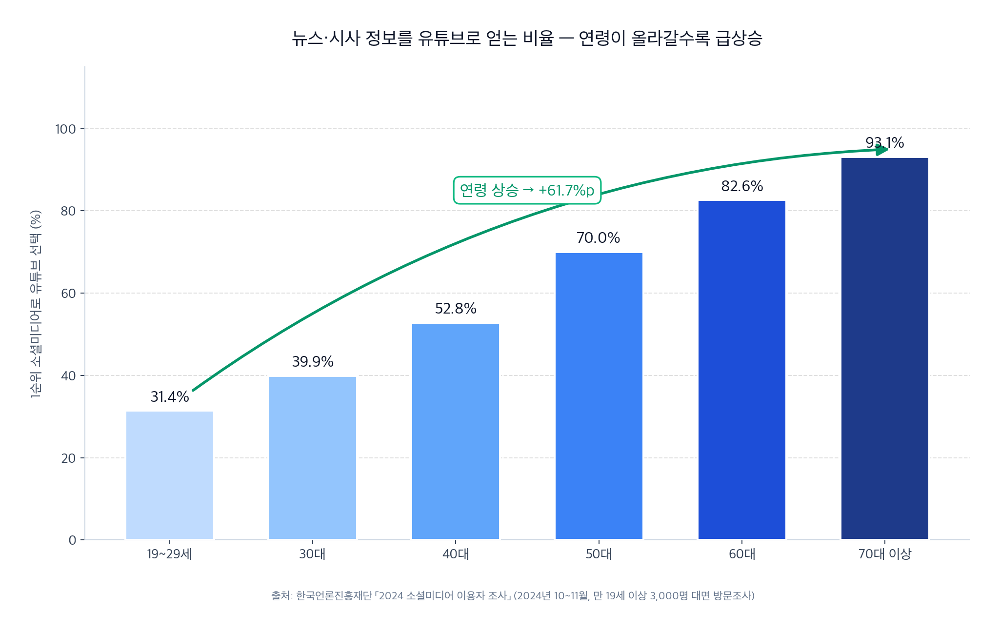

 출처: 한국언론진흥재단 「2024 소셜미디어 이용자 조사」 (2024년 10~11월, 만 19세 이상 3,000명 방문면접)[^stat-kpf-sns].

- 19~29세 31.4% → 30대 39.9% → 40대 52.8% → 50대 70.0% → 60대 82.6% → 70대 이상 <mark>**93.1%**</mark> 로, 최고·최저 차이가 <mark>**61.7%p**</mark>에 달한다. 영상 중심 정보 소비가 **고령층에서 오히려 더 강하다**는 뜻이다.
- **고령층의 숏폼 의존은 '스마트폰 과의존 고위험군' 증가로 이어지고 있다** — 과기정통부·한국지능정보사회진흥원(NIA) 「2024 스마트폰 과의존 실태조사」 기준 <mark>**60대 고위험군 비율 2022년 3.0% → 2023년 3.1% → 2024년 3.7%**</mark>, **전 연령층 중 60대만 3년 연속 증가**. 조사에서 **60대의 숏폼 이용 증가**가 고위험군 증가의 배경으로 지목되었다[^stat-smartphone-dependence].
- **60세 이상 SNS 최장시간 앱 1·2위는 틱톡 계열** — 와이즈앱 2024년 6월 데이터 기준 <mark>**틱톡 라이트 2,244만 시간(1위), 틱톡 1,281만 시간(2위)**</mark>, 인스타그램 566만 시간(3위)[^stat-senior-tiktok]. **AI 허구 권위자·딥페이크 허위광고에 더 쉽게 속을 수 있는 취약층**까지 이미 숏폼 이커머스 동선 안에 깊이 포섭되어 있다.

#### 결론

광고 = 상세페이지 = 결제 유도가 한 화면에 압축된 이 구조에서, **광고 영상 자체의 허위·과장 여부를 판별하지 못하면 소비자는 검증 단계 없이 구매로 직행**한다. 이 구조적 단축이 §1.1.4 허위·과장 광고 악화의 위력을 증폭시키는 **핵심 메커니즘**이다.

### 1.1.4 허위·과장 광고의 구조적 악화

**식약처 2024 집중 점검 결과** — 본 프로젝트가 다루는 규제 민감 카테고리(건기식·화장품·다이어트)에서 허위·과대 광고가 대규모로 적발되고 있다.

| 점검 영역 | 적발 건수 | 출처 |
|-----------|-----------|------|
| 연휴 시즌 온라인 광고 (식품·화장품) | <mark>**194건**</mark> | 식약처 2024 집중 점검[^stat-mfds-holiday] |
| 체형 유지·체중 감량 표방 화장품 | <mark>**124건**</mark> | 식약처 2024[^stat-mfds-slim] |
| 홍삼 등 건강기능식품 키워드 판매 | <mark>**89건**</mark> | 식약처 2024 집중 점검[^stat-mfds-hg] |
| SNS 화장품 과대광고 3년 추세 | <mark>**6배 증가**</mark> | MBC 단독 보도 2024[^stat-mbc-cosmetics] |

**AI 딥페이크 허위광고의 출현** — 2024~2025년 새로운 형태의 광고 기만이 급증했다. 한국경제 2025-12-10 보도로 드러난 구체 사례가 대표적이다.

> **"<mark>'S대 출신 전문의'가 등장해 '흔들리는 치아, 치과 오지 마세요. 이것만 해도 꽉 잡힙니다', '의사가 바라본 최악의 지루성 두피염 치료법, 딱 3개월만 드셔보세요' 등의 멘트로 식·의약품 효능을 홍보</mark>했지만, 이들은 모두 실존 인물이 아닌 AI 딥페이크로 제작된 가짜 전문가로 드러났다."**[^stat-ai-deepfake]

- 유튜브·SNS에서 이런 **허구 권위자(AI 생성)** 가 영양제·다이어트 보조제·의약품 등을 추천하는 숏폼 광고가 범람 중이다[^stat-ai-deepfake].
- 흰 가운·전문 용어·의료기관 배경 등 **신뢰 프레임**을 AI로 손쉽게 재현해 과장된 효능 주장을 뒷받침한다.

**실제 사례 — 유튜브 숏폼에 유포된 AI 딥페이크 '의사 광고' 4건**

<table>
  <tr>
    <td width="50%" align="center" valign="top">
      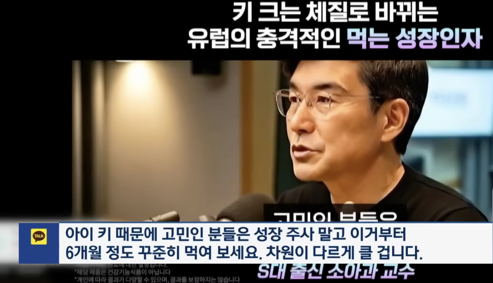
       
      <b>사례 ①</b> · <i>"S대 출신 소아과 교수"</i> 자칭 "키 크는 체질로 바꾸는 먹는 성장인자" — 아동용 성장 보조제 추천 <i>출처: YouTube Shorts 캡처 (2025-12)</i>
    </td>
    <td width="50%" align="center" valign="top">
      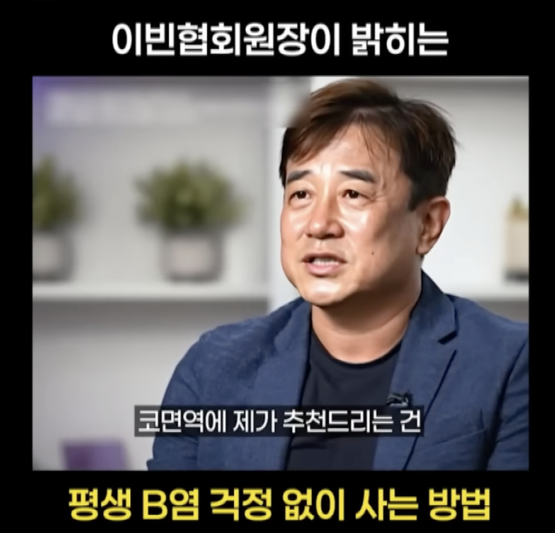
       
      <b>사례 ②</b> · <i>"이빈협회원장"</i> 자칭 "평생 비염 걱정 없이 사는 방법" — 코면역 관련 제품 추천 <i>출처: YouTube Shorts 캡처 (2025-12)</i>
    </td>
  </tr>
  <tr>
    <td width="50%" align="center" valign="top">
      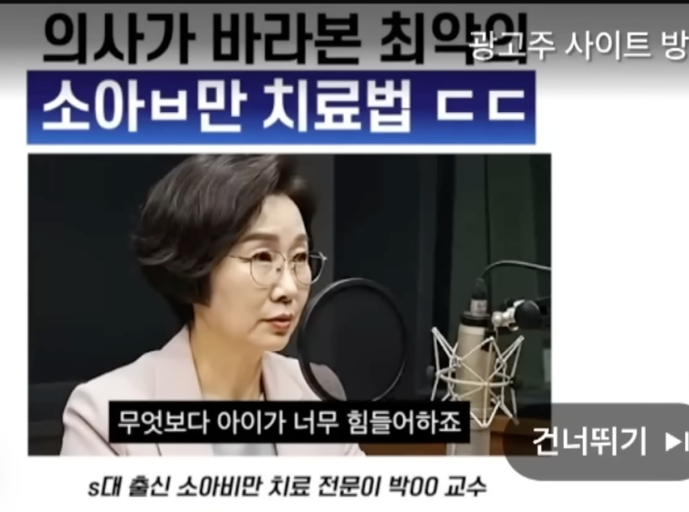
       
      <b>사례 ③</b> · <i>"S대 출신 소아비만 치료 전문의 박OO 교수"</i> 자칭 "의사가 바라본 최악의 소아비만 치료법" <i>출처: YouTube Shorts 캡처 (2025-12)</i>
    </td>
    <td width="50%" align="center" valign="top">
      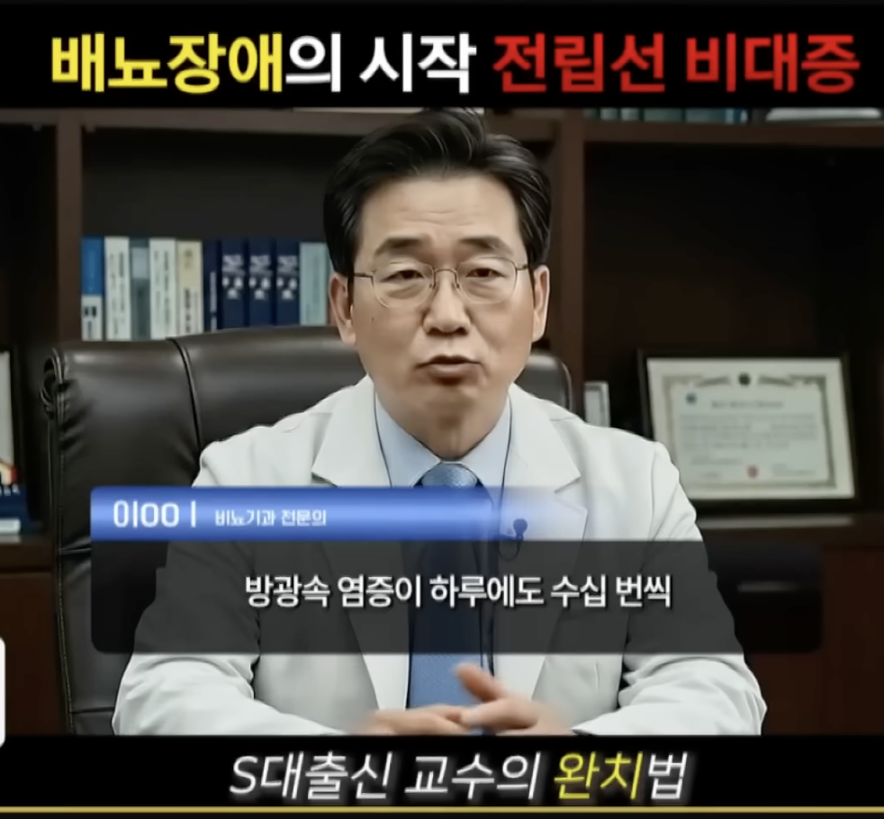
       
      <b>사례 ④</b> · <i>"이OO 비뇨기과 전문의 · S대 출신 교수"</i> 자칭 "배뇨장애의 시작 전립선 비대증 — S대 출신 교수의 완치법" <i>출처: YouTube Shorts 캡처 (2025-12)</i>
    </td>
  </tr>
</table>

> ⚠️ **자료 성격** — 본 이미지들은 유튜브 등 숏폼 플랫폼에서 유포 중인 실제 AI 딥페이크 의사 광고의 스크린샷이다. **교육·연구 목적 인용**이며, 허위·기만성을 부각하기 위한 비평적 제시다. 4건 모두에서 공통 패턴이 반복된다:
>
> 1. **권위 자칭** — "S대 출신", "교수", "전문의", "협회원장" 등 검증 불가 자격
> 2. **의료 스튜디오 세팅** — 마이크·책장·흰 가운·실내 촬영 프레임으로 신뢰감 조성
> 3. **구체 효능 주장** — "키 크는 체질", "6개월 꾸준히", "완치법" 등 임상 근거 없는 단정
> 4. **대상 취약층 겨냥** — 아동(성장·비만), 중장년(비염·전립선) 등 당사자·보호자의 절박함을 이용
>
> ※ 정부 AI 생성물 표시 의무제는 2025-12-10 종합대책 발표 이후 2026-04-08 공정위 심사지침 개정안 행정예고(~04-28, **시행 전**) 단계로 **도입이 추진되고 있는 상황**이나, 위 4건과 같이 **AI 생성 표시 없이** 유통되는 광고가 여전히 관측된다.

**정부 대책 — 2025-12-10 방미통위 등 관계부처 합동 발표**

정부는 2025년 12월 10일 **「AI 신기술 활용 거래질서 교란 행위 대응책」** 을 발표했다. 방송미디어통신위원회(방미통위)를 중심으로 **3개 문제점 → 3개 개선 방안** 구조로 정리된다[^stat-ai-regulation].

| 문제점 (현행) | 개선 방안 | 구체 조치 |
|---------------|-----------|-----------|
| AI 허위·과장 광고 유통 막을 **근거 부재** | 생성·유통 **사전 방지** | 게시자(AI 생성물 표시 의무) · 플랫폼사(표시 관리 의무) · 이용자(표시 임의 제거·훼손 금지) 3주체 의무 부과 |
| 허위·과장 광고 **사후차단에 시일 소요** | **유통 전 신속 차단** | 방미심위 **서면심의 신속화** (언론 보도 기준 **24시간 이내**), 방미통위 **긴급 시정요청 제도**, 플랫폼 자율 모니터링·차단 확대 |
| 게시자 단속·제재 **불충분** | 금전제재 강화 · 단속역량 확충 | **'가상인간' 미표시 시 부당광고로 규정**, <mark>**징벌적 손해배상 최대 5배**</mark> 및 과징금 수준 대폭 상향, 식약처·소비자원 감시·적발 기능 강화 |

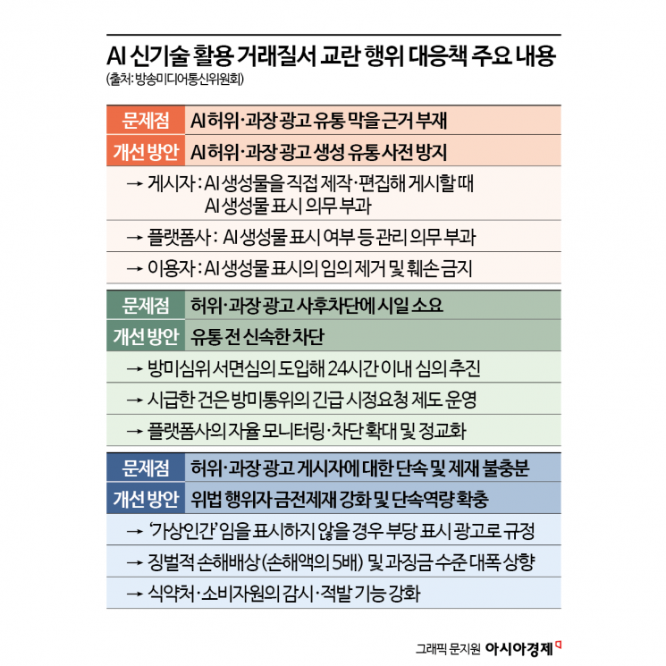

출처: 방송미디어통신위원회 「AI 신기술 활용 거래질서 교란 행위 대응책」 (2025-12-10 정책브리핑)[^stat-ai-regulation]. 그래픽: 아시아경제 문지원 기자.

**2026-04 업데이트 — 대책의 구체화는 진행, 집행 공백은 여전** — 2025-12-10 종합대책 발표 후 약 4개월이 지난 2026 Q1, 후속 법제화가 이어졌다. <mark>**2026-01-22 「AI 기본법」 본격 시행**</mark>(세계 두 번째 포괄 AI 규제) · <mark>**2026-04-08 공정위 「추천·보증 등에 관한 표시·광고 심사지침」 개정안 행정예고**</mark>(예고기간 ~04-28 — 생성형 AI·딥페이크 가상인물 광고에 "가상인물" 표시 의무화, 추천·보증 주체 5번째 유형 신설, 위반 시 시정명령·과징금·형사처벌)[^stat-2026q1-update]. **그러나 이들 조치 역시 사후 표시 의무·제재 구조**로, **광고주 자율 준수에 의존하는 구조적 한계(아래 4점)는 그대로다.**

**요컨대 이를 실제로 차단하기는 구조적으로 어렵다.**

1. **탐지 도구 없는 법은 실효성이 낮다** — 규제기관·플랫폼이 AI 생성물을 대규모·자동으로 탐지할 수 없으면, 규정만으로는 사실상 무용지물이다[^stat-deepfake-global].
2. **표시 의무는 광고주 준수에 의존** — 양심적 광고주는 표시하지만, 고의 허위광고는 애초에 표시를 건너뛴다. **미표시 광고가 여전히 유통**된다 (위 §1.1.4 실제 사례 4건이 그 증거).
3. **플랫폼 검수 용량 한계** — 글로벌 사례로 2025년 10월 **Meta 한 곳에서만 63개 사기 광고주가 150,600건의 딥페이크 광고(정치·인물 사칭 중심)를 집행**, 제거 전까지 약 $49M이 지출되었다[^stat-deepfake-global]. 카테고리는 다르나 **단일 플랫폼의 자동 검수 역량 한계**를 보여주는 규모 지표다. 또한 WSJ 2025-05 보도에 따르면 Meta 는 사기 광고주에 **8~32회의 자동 경고(strike) 를 부여한 뒤에야 계정을 차단**하며, Meta 2022년 내부 분석에서 **신규 광고주의 70%가 사기·불법 제품·저품질 상품 홍보**로 파악됐다. **광고 수익(연 $160B · +22%)과의 충돌**이 신속 차단을 지연시키는 **자율 규제 vs 수익의 구조적 갈등** 요인으로 지목된다[^stat-meta-wsj].
4. **사후 구제의 한계** — 징벌적 손배는 피해자가 스스로 입증·소송을 해야 작동한다. 숏폼의 **24~72시간 휘발성 노출**과 사법 절차 속도가 구조적으로 불일치한다.

→ 규제 프레임은 구축되는 중이나, <mark>**소비자가 영상을 보는 바로 그 순간 허위 여부를 판별할 수단**</mark>은 여전히 공백이다. **본 프로젝트의 존재 이유가 여기에 있다.**

## 1.2 문제 제기 — 네 흐름이 교차하는 지점

> 한국인이 스마트폰으로 영상에 쓰는 시간은 하루 평균 **97분**,
> 한 번 숏폼 피드를 열면 평균 **21분** 동안 다음 영상, 그 다음 영상으로 미끄러진다[^stat-shortform].
> 그 21분 안에 우리는 수십 개의 상품 광고를 "지나친다."
> **"이 상품, 진짜야?"** 라고 의심할 시간은 몇 초뿐이다.
>
> **이 장면이 바로 §1.1에서 본 네 흐름이 한 지점에서 교차하는 지점이다.**
>
> - **① 시장 확대** — 이커머스 거래액이 6년 만에 **2배(134조→272조)** 로 팽창 (§1.1.1)
> - **② 채널 이동** — 광고 주력 채널이 포털에서 **숏폼·AI** 로 이동 (§1.1.2)
> - **③ 소비 가속** — 사용자가 숏폼 피드에서 **21분 플로우**로 수십 개 광고를 스쳐 지나감 (§1.1.3)
> - **④ 공급 폭증** — AI 생성으로 허위·과장 광고 **공급 비용이 극단적으로 낮아짐**, 규제는 사후적 (§1.1.4)
>
> 이 교차점에서 **본 프로젝트가 풀어야 할 문제**가 모습을 드러낸다.

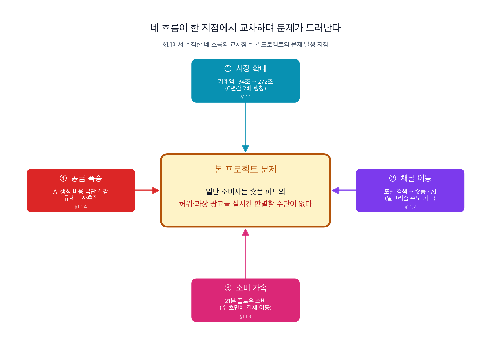

### 1.2.1 문제 정의

§1.1에서 이커머스의 정의와 시장 규모(272조·6년 2배), 광고 채널의 숏폼·AI 이동, 소비 퍼널의 압축, 허위·과장 광고의 구조적 악화(식약처 수백 건 적발·AI 딥페이크 범람·정부 대책의 집행 공백)를 차례로 확인했다. 이 네 흐름이 한 지점에서 교차하며 본 프로젝트가 해결할 문제가 모습을 드러낸다.

> **정의** — <mark>**일반 소비자는 YouTube Shorts · Instagram Reels · TikTok 피드에서 빠르게 스쳐 지나가는 건강기능식품·화장품·다이어트 상품 광고의 영상·자막·주장 중 어떤 부분이 허위 또는 과장인지 실시간으로 판별할 수 없다.**</mark> 이 판별 공백은 **광고 = 상세페이지 = 결제 유도**가 한 영상에 압축된 숏폼 퍼널 구조에서 **검증 단계 없이 구매로 직행**하게 만들며, AI 딥페이크 허구 권위자의 기만 광고에는 중장년·고령층 취약층까지 **무방비로 노출**되어 있다.

문제는 다음 세 요소로 분해된다:

| 축 | 내용 |
|-----|------|
| **누가 (Who)** | 일반 소비자 — 특히 유튜브·틱톡 의존도가 높은 **중장년·고령층** 취약층 포함 (§1.1.3) |
| **어디서 (Where)** | YouTube Shorts · Instagram Reels · TikTok의 **건기식·화장품·다이어트** 규제 민감 카테고리 광고 (§1.1.0 스코프, §1.4.1) |
| **무엇을 못하는가 (What)** | 영상·자막·주장의 **허위·과장 여부**를 _영상이 스쳐 지나가는 그 순간_ **실시간으로 판별**(§1.1.3 압축 퍼널) |

### 1.2.2 숏폼 광고에서 자주 나타나는 허위·과장 유형

| 유형 | 숏폼에서의 구현 방식 |
|------|---------------------|
| 효능·효과 과장 | "2주 만에 X kg 감량", "피부 즉시 변화" 등을 **편집·자막·연출**로 극적 시연 |
| 이미지·영상 조작 | Before/After **영상 합성**, 각도·조명·필터로 시연 결과 과장 |
| 권위 사칭·딥페이크 | 연예인·의사·전문가 얼굴·음성 **AI 합성** 또는 무단 편집 — §1.1.4 실제 4건 사례[^stat-ai-deepfake] |
| 가짜 체험담 | 배우·지인이 연기한 **가짜 사용자 리뷰 영상** |
| 심리 조작 | "오늘만", "마감 임박" **카운트다운 자막** 반복 노출 |
| 가격·수량 허위 | 정상가 부풀린 뒤 할인율 표기, "단 100개" 상시 표기 |
| 링크 미스리딩 | 영상은 국내 브랜드처럼 보이나 링크는 **해외 드롭쉬핑 저품질 몰** |
| AI 생성 광고 | AI 이미지·AI 음성·AI 카피로 대량 제작된 **실물 없는 상품** 광고 — 2026-04 공정위 '가상인물' 표시 의무화 대상[^stat-2026q1-update] |

### 1.2.3 문제의 빈도·강도 (교차 검증된 지표)

- **식약처 2024 집중 점검** — 규제 민감 카테고리에서 <mark>**연휴 시즌 온라인 광고 194건 · 체형·체중 표방 화장품 124건 · 홍삼 등 건기식 89건**</mark> 부당광고 적발 (§1.1.4 표 참조, 출처: [의료월드뉴스](https://www.medicalworldnews.co.kr/m/view.php?idx=1510963196)[^stat-mfds-holiday] · [YTN 2024-12-24](https://www.ytn.co.kr/_ln/0103_202412241037294705)[^stat-mfds-slim] · [식약처 식품안전나라](https://www.foodsafetykorea.go.kr/portal/board/board.do?menu_grp=MENU_NEW01&menu_no=4838)[^stat-mfds-hg]).
- **식약처 SNS 부당광고 3년간 약 6배 급증** — MBC 단독 보도(2024) 직접 인용: _"3년 전 6백여 건에 그쳤던 SNS 부당 광고 적발 건수는 점점 늘어나 지난해엔 3천6백 건을 기록했습니다."_ 즉 <mark>**2021년 약 600건 → 2023년 3,600건**</mark>이며, 같은 기간 **제재 인플루언서는 400명 → 1,200명 (3배)** 으로 증가[^stat-mbc-cosmetics]. **공급이 단속 속도를 현격히 추월**하고 있음을 시사한다.
- **AI 딥페이크 가짜 전문가 광고 범람** — 한국경제 2025-12-10 보도 기준 <mark>"S대 출신 전문의"</mark>가 "흔들리는 치아, 치과 오지 마세요. 이것만 해도 꽉 잡힙니다"·"의사가 바라본 최악의 지루성 두피염 치료법, 딱 3개월만 드셔보세요" 등 멘트로 **식·의약품 효능**을 홍보하는 숏폼 광고가 유튜브·SNS에 범람, **실존 인물이 아닌 AI 딥페이크 가짜 전문가**로 밝혀졌다[^stat-ai-deepfake]. 본 기획서 **§1.1.4 에서 실제 4건의 사례 스크린샷**으로 공통 패턴(권위 자칭·의료 스튜디오·구체 효능·취약층 겨냥) 확인.
- **정부 공식 위험도 인정 (2025-12-10)** — 방송미디어통신위원회 등 관계부처 합동 「AI 신기술 활용 거래질서 교란 행위 대응책」 발표 — <mark>**AI 생성물 표시 의무제 + 5배 징벌적 손해배상 + 서면심의 신속화**</mark>(언론 보도 기준 24시간 이내)[^stat-ai-regulation]. 정책브리핑 원문: <https://www.korea.kr/news/policyNewsView.do?newsId=148956230>.
- **팀 자체 샘플링 (계획)** — 숏폼 3종 플랫폼에서 건기식·화장품·다이어트 광고 **N건 수집 후 허위·AI 생성 유형별 분류 예정**. 상세 데이터셋 구축 계획은 §4 AI 기술 적용 방안에서 확정한다.

## 1.3 문제 발생 맥락

- **소비자 인지 관점** — 숏폼은 한 영상당 **15~60초** 길이로 빠르게 전환되며, 한 번 보기 시작하면 <mark>평균 21분간 연속 시청</mark>하는 **플로우(flow) 소비** 형태다[^stat-shortform]. 스와이프 관성에 의해 비판적 판단 전 다음 영상으로 이동하므로, 일반 이커머스 광고보다도 진위 검증 여유가 구조적으로 부족하다.
- **형식의 기만성** — 숏폼 광고는 **일반 크리에이터 콘텐츠와 시각적으로 구분이 어렵다**. "광고" 고지가 눈에 띄지 않거나, 인플루언서 후기처럼 포장된다.
- **플랫폼 검수 한계** — YouTube·Meta·TikTok은 **일일 수백만 건**의 광고를 자동 심사에 의존하며, 한국어 시장·한국 법령에 특화된 검수가 약하다. 텍스트 필터로는 영상·음성 속 주장 검증이 불가능.
- **제재의 사후성** — 공정위 시정조치는 **이미 유통·구매가 일어난 후** 작동. 숏폼의 **휘발성(24~72시간 내 노출 효과 집중)** 과 법적 절차 속도가 구조적으로 불일치.
- **현재의 우회적 대처**
  - 소비자: 댓글·외부 검색·커뮤니티 후기 의존 → 영상이 지나간 뒤엔 재탐색 비용 큼
  - 플랫폼: 키워드·신고 기반 자동화, 광고주 자진 준수 가이드 → 커버리지 한계
  - 규제기관: 모니터링 요원·언론·민원 기반 단속 → 속도·범위 모두 부족 (MBC 단독 보도: **식약처 내 SNS 부당광고 담당자 13명** 규모에 머물러 실질 단속 구조적 한계[^stat-mbc-cosmetics])
  - 정직한 셀러: 자율 표시·공정거래 준수 + 업계 자율 가이드 의존 → 허위 광고주 제재 속도 따라가지 못해 **비교우위 상실**

### 1.3.1 개입 방식의 선택 — 왜 "사용자 능동 호출"인가

§1.2~§1.3 에서 드러난 문제의 본질은 <mark>**영상이 스쳐 지나가는 그 순간의 판별 공백**</mark>이다. 가장 이상적 해법은 **피드 위 자동 오버레이** — 영상 재생과 동시에 AI가 판별해 경고를 덧씌우는 방식이다. 그러나 다음 세 제약이 _MVP 단계의 자동 개입_ 을 구조적으로 차단한다.

| 제약 | 내용 | 근거 |
|------|------|------|
| **플랫폼 TOS·API 제약** | YouTube·Instagram·TikTok 모두 앱 내 영상 스트림을 제3자 앱이 가로채는 행위를 약관으로 금지. 공식 광고 콘텐츠 분석 API는 부재. | 각 플랫폼 개발자 정책 |
| **OS 수준 API 제약** | iOS·Android는 타 앱 화면에 실시간 오버레이 허용 안 함 (접근성 API는 용도 제한, 심사 통과 난이). | iOS App Review Guideline · Android Accessibility Policy |
| **비용·지연 (학습 프로젝트 범위)** | 전체 피드 영상을 스트리밍 분석하려면 다운로드·멀티모달 추론·결과 반환을 초 단위로 보장해야 함 — 학생 팀 리소스 밖. | §1.5 데이터·§4 기술 적용 계획 |

따라서 <mark>**MVP에서의 "실시간"은 "자동 개입"이 아니라 "사용자가 의심한 순간 수 초 내 응답"으로 재정의**</mark>한다. 구체적으로는 다음과 같은 UX를 선택한다.

- **공유 시트(Share Sheet) 기반 능동 호출** — 사용자가 숏폼 앱 내에서 영상을 보다 의심을 느끼는 순간, _이미 익숙한 동작_(공유 버튼 탭 → 본 앱 선택)으로 분석을 트리거한다. 별도 앱 전환·URL 복사·스크린샷 전송 없이 **한 번의 시스템 제스처**로 요청이 완결된다.
- **수 초 내 리포트 반환** — 공유 직후 분석 결과(위반 유형·근거·관련 규정)가 리포트 형태로 즉시 제시된다. _사용자 체감_ 상 "영상을 본 그 순간" 판별이 성립한다.

이 선택은 다음 네 근거로 정당화된다.

1. **사용자 친숙한 패턴** — 뉴스 팩트체크·악성 URL 검사·번역 도구 등 대부분의 보조 서비스가 이미 공유 시트로 작동 중이며, 모바일 사용자는 "의심되면 공유"라는 멘탈 모델을 이미 보유한다.
2. **플랫폼 TOS 준수** — 공유는 플랫폼이 공식 제공하는 인터페이스이므로 스트림 가로채기와 달리 약관 위반 소지가 없다.
3. **오탐 부담 감소** — 모든 영상이 아닌 **사용자가 실제 의심한 영상만** 분석 대상이 되므로, 분석 품질과 사용자 신뢰를 동시에 확보한다.
4. **취약층 보호와 양립** — 고령층(§1.1.3)의 공유 버튼 숙련도는 상대적으로 낮을 수 있다. 이에 대한 보완은 §2 페르소나·§3 서비스 개요에서 **원클릭 플로우·큰 버튼·음성 안내** 등 UX 설계 단위로 처리한다.

**향후 확장 여지** — 브라우저 확장 프로그램(데스크톱 YouTube 환경 자동 검사), 플랫폼 공식 파트너십, 규제기관 API 연동을 통한 사전 모니터링은 본 기획 범위 밖 **Phase 2** 후보로 남겨둔다.

→ 이 결정을 근거로 §1.6에서 "서비스 폼팩터 = 모바일 앱 + OS 공유 시트 연동"이 확정된다.

## 1.4 주제 선택 이유

본 프로젝트를 _지금 · 여기서_ 수행해야 하는 이유를 5가지 축으로 정리한다. 각 축은 §1.1~§1.3 에서 논의된 근거와 직접 연결된다.

먼저 본 프로젝트가 이커머스 가치사슬에서 차지하는 **좌표**를 짚는다 — 11개 레이어(L1 소싱 → L11 재구매) 중 공급 측 <mark>**L4 광고·마케팅**</mark>과 수요 측 <mark>**L6 의사결정 지원**</mark> 교차점에 위치한다. 5번째 이유(④ 도메인 좌표)가 이 좌표를 가리키며, 스코프 축의 구체화는 [§1.4.1](#141-스코프-축-정리--l4--l6-좌표의-구체화)에 둔다.

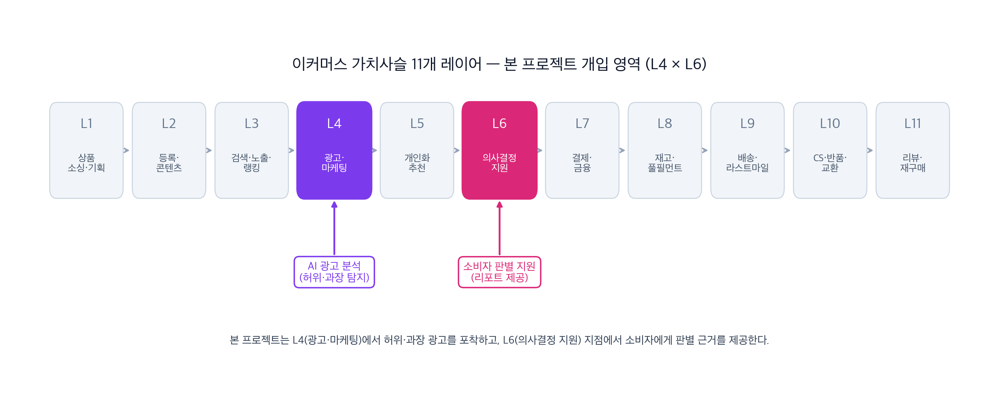

이 좌표를 전제로 다음 **5가지 선택 이유**가 성립한다.

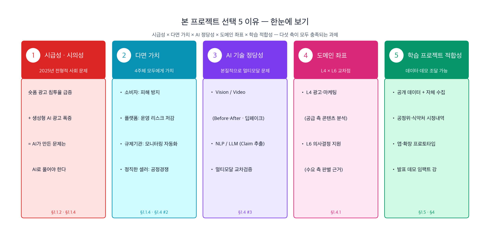

### 1️⃣ 시급성·시의성 — <mark>2025년의 전형적 사회 문제</mark>

숏폼 광고 침투율 급증(§1.1.2)과 생성형 AI 광고 폭증(§1.1.4)이 **2024~2025년에 겹쳤다**. 정부가 2025-12-10 종합대책을 발표해야 할 만큼 **사회적 위험도가 공식 인정**된 영역이다. <mark>**"AI가 만든 문제는 AI로 풀어야 한다"**</mark> — 이보다 정당한 AI 응용 과제는 드물다.

### 2️⃣ 다면 가치 — <mark>4주체 모두에게 가치</mark>

| 이해관계자 | 이 프로젝트가 주는 가치 |
|-----------|-------------------------|
| **소비자** (1차 타겟) | 영상 노출 순간의 **허위·과장 판별 근거** 제공 → 구매 전 보호 |
| **플랫폼** (YouTube·Meta·TikTok) | 운영·규제 리스크 저감 · 자율 모니터링 고도화 보조 |
| **규제기관** (공정위·식약처·방미통위) | **광고 모니터링 자동화** — 서면심의 신속화 체계 보완 |
| **정직한 셀러** | 허위 광고 경쟁자 대비 **전환율 회복** · **브랜드 신뢰도 재구축** — 규제 리스크 회피 |

### 3️⃣ AI 기술 정당성 — <mark>본질적으로 멀티모달 AI 문제</mark>

숏폼 광고는 영상·자막·음성·랜딩페이지·상품DB가 교차된 복합 매체다. **룰·CRUD·키워드 필터로는 구조적으로 풀 수 없다**. 본 프로젝트는 다음 **3축**으로 구성한다:

- **Vision / Video Understanding** — Before/After 합성 탐지 · 연예인·전문가 딥페이크 탐지 · 장면·객체 분석
- **NLP / LLM** — 자막·카피·설명란 텍스트에서 claim 추출 → **표시광고법·식약처 허용 표현 DB** 와 맵핑하여 위반 유형 분류
- **멀티모달 교차검증** — 영상 장면 ↔ 자막·카피 ↔ 랜딩페이지 상세정보 ↔ 상품DB의 **정합성 검증**

### 4️⃣ 도메인 좌표 — <mark>L4(광고·마케팅) × L6(의사결정 지원) 교차점</mark>

이커머스 가치사슬 11개 레이어 중 공급 측 **L4**에서 허위·과장 광고 콘텐츠를 포착하고, 수요 측 **L6**에서 소비자에게 판별 근거를 제공하는 **이중 개입 구조**다. 1차 이해관계자는 **소비자**, 2차로 플랫폼·규제기관에 가치 확장 가능. 상세는 §1.4.1 개입 좌표 시각화 참조.

### 5️⃣ 학습 프로젝트 적합성 — <mark>데이터·데모 조달 가능</mark>

- **데이터 조달 경로**: 공개 데이터(광고 영상·공정위 시정조치 내역·식약처 부당광고 사례) + 자체 크롤링·합성 + 팀 샘플링(§4에서 상세화).
- **데모 임팩트**: 모바일 앱 프로토타입(§1.6 서비스 폼팩터) 형태로 **발표 시 바로 시연 가능** — "의심 영상 공유 → 즉시 리포트" 플로우가 청중의 공감을 직관적으로 확보한다. 브라우저 확장 등 다른 폼팩터는 §1.3.1 Phase 2 후보.
- **범위 제어 용이**: §1.1.0 스코프(건기식·화장품·다이어트 × 숏폼 3종)가 학생 팀 리소스 내에서 합리적으로 끝낼 수 있는 크기다.

### 1.4.1 스코프 축 정리 — L4 × L6 좌표의 구체화

§1.4 도입부에서 시각화한 가치사슬 좌표(L4 × L6)를 본 프로젝트가 다루는 구체 범위로 분해한다. **공급 측 L4 광고·마케팅에서 허위·과장 광고 콘텐츠를 포착**하고, **수요 측 L6 의사결정 지원에서 소비자에게 판별 근거를 제공**하는 <mark>**공급 → 수요 이중 개입 구조**</mark>를 다음 4개 축으로 한정한다.

> 아래 표는 범위 구성 요소를 **사전에 조합한 해설본**이며, 기획서의 최종 확정본은 [§1.6 서비스 범위 요약](#16-서비스-범위-요약) 에 제시된다.

| 스코프 축 | 본 프로젝트 대상 | 제외 영역 |
|----------|-----------------|-----------|
| 가치사슬 레이어 | <mark>**L4 광고·마케팅 + L6 의사결정 지원**</mark> | L1 소싱 · L8 재고 · L9 배송 · L10 CS · L11 재구매 등 |
| 거래 주체 | <mark>**B2C · B2B2C**</mark> | B2B 산업재 · C2C 중고거래 |
| 상품 카테고리 | <mark>**건강기능식품 · 화장품 · 다이어트 상품**</mark> (표시광고법·식약처 규제 민감) | 일반 공산품 · 가전 · 식품 전반 |
| 노출 채널 | <mark>**숏폼 동영상 광고 (YouTube Shorts · Instagram Reels · TikTok)**</mark> | 포털 검색광고 · 앱 내 광고 · 오프라인 O2O |

> 상세 레이어 정의는 [`docs/research/01_domain_definition.md`](../research/01_domain_definition.md) 참고.

## 1.5 근거·통계

### 1.5.1 핵심 통계 요약

| 지표 | 수치 | 출처 |
|------|------|------|
| 국내 온라인쇼핑 연간 거래액 (2025) | <mark>272조 398억 원</mark> (전년 대비 4.9%↑) | 통계청 온라인쇼핑동향[^stat-ecomm] |
| 국내 온라인쇼핑 연간 거래액 (2024) | 약 259조 원 | 통계청 온라인쇼핑동향[^stat-ecomm] |
| 숏폼 연속 시청 평균 시간 (2025, 1회 세션) | <mark>21분</mark> | 컨슈머인사이트 Telecom Report '25-14[^stat-shortform] |
| 스마트폰·태블릿 영상 시청 시간 (2025) | 하루 평균 97분 | 컨슈머인사이트 Telecom Report '25-14[^stat-shortform] |
| 식약처 연휴 시즌 온라인 광고 점검 — 부당광고 적발 (2024) | <mark>**194건**</mark> | 식약처[^stat-mfds-holiday] |
| 식약처 체형·체중 화장품 점검 — 허위·과대 적발 (2024) | <mark>**124건**</mark> | 식약처[^stat-mfds-slim] |
| 식약처 건기식 키워드 판매 점검 — 부당광고 적발 (2024) | <mark>**89건**</mark> | 식약처[^stat-mfds-hg] |
| SNS 화장품 과대광고 3년 증가율 | <mark>**6배**</mark> | MBC 단독 보도 2024[^stat-mbc-cosmetics] |
| AI 생성물 표시 의무제·징벌적 손배 5배 | 2025-12-10 정부 종합대책 | 관계부처 합동[^stat-ai-regulation] |
| 70대 이상 뉴스·시사 유튜브 선택 비율 (2024) | <mark>**93.1%**</mark> (19~29세 대비 +61.7%p) | 한국언론진흥재단[^stat-kpf-sns] |
| 「AI 기본법」 본격 시행 | <mark>**2026-01-22**</mark> (세계 두 번째 포괄 AI 규제) | 2026 Q1 후속 법제[^stat-2026q1-update] |
| 공정위 표시·광고 심사지침 개정안 — '가상인물' 표시 의무화 | 2026-04-08 ~ 04-28 행정예고 | 2026 Q1 후속 법제[^stat-2026q1-update] |
| Meta 사기 광고주 strike 체계 — 8~32회 경고 후 차단 | 자율 규제 vs 광고 수익 갈등 | WSJ 2025-05 보도[^stat-meta-wsj] |
| 60대 스마트폰 과의존 고위험군 — 3년 연속 증가 | 2022년 3.0% → 2024년 **3.7%** (전 연령 중 유일 증가) | 과기정통부·NIA[^stat-smartphone-dependence] |

---

### 출처 (References)

[^stat-ecomm]: 통계청 「온라인쇼핑동향조사」 공식 지표 — 2025년 272조 398억 원(전년 대비 4.9%↑) 수치는 **KDI 경제교육·정보센터 요약에 직접 게재되어 검증 가능**: <https://eiec.kdi.re.kr/policy/materialView.do?num=262891>. 통계청 공식 지표 설명(메타데이터 페이지): <https://mods.go.kr/statDesc.es?act=view&mid=a10501010000&sttr_cd=S009007>. 접속일 2026-04-18 ~ 2026-04-20.

[^stat-shortform]: 컨슈머인사이트 「숏폼 한번 보면 평균 21분, 4명 중 3명 유튜브로 본다」, Telecom Report '25-14 (2025-08-14). **보도자료 직링크**: ZDNet Korea 「숏폼 한 번 보면 20분 넘게...주로 유튜브로 시청」 (2025-08-15) <https://zdnet.co.kr/view/?no=20250815001245> · 파이낸셜뉴스 (2025-08-14) <https://www.fnnews.com/news/202508140952342815>. 컨슈머인사이트 공식 사이트: <https://www.consumerinsight.co.kr/>. 접속일 2026-04-18 ~ 2026-04-20.

[^stat-mfds-holiday]: 식품의약품안전처 2024년 집중 점검 — 연휴 시즌(설·추석) 선물용 식품 및 화장품 온라인 광고 점검에서 부당광고 194건 적발. 의료월드뉴스 보도: <https://www.medicalworldnews.co.kr/m/view.php?idx=1510963196>. 접속일 2026-04-18 ~ 2026-04-20.

[^stat-mfds-slim]: 식품의약품안전처 2024년 — 체형 유지·체중 감량 표방 화장품 온라인 판매 점검에서 허위·과대광고 124건 적발. YTN 보도 「"지방분해·체중감량"…식약처, 허위 과대광고 적발」 (2024-12-24): <https://www.ytn.co.kr/_ln/0103_202412241037294705>. 접속일 2026-04-18 ~ 2026-04-20.

[^stat-mfds-hg]: 식품의약품안전처 2024년 집중 점검 — 홍삼 등 건강기능식품 검색 키워드 판매 제품 부당광고 89건 적발. 식약처 식품안전나라 부당광고 자료실: <https://www.foodsafetykorea.go.kr/portal/board/board.do?menu_grp=MENU_NEW01&menu_no=4838&ctgType=CTG_TYPE01&ctgryno=2255>. 접속일 2026-04-18 ~ 2026-04-20.

[^stat-mbc-cosmetics]: MBC 뉴스데스크 단독 보도 「"화장품 바르면 시술 효과" SNS 과대광고 3년새 6배 적발」 (2024) — <https://imnews.imbc.com/replay/2024/nwdesk/article/6643465_36515.html>. 접속일 2026-04-18 ~ 2026-04-20.

[^stat-ai-deepfake]: 한국경제 「SNS속 딥페이크 광고…AI 표시 안하면 5배 징벌적 손배 추진」 (2025-12-10) — 원문 확인 인용: _"'S대 출신 전문의'가 등장해 '흔들리는 치아, 치과 오지 마세요. 이것만 해도 꽉 잡힙니다', '의사가 바라본 최악의 지루성 두피염 치료법, 딱 3개월만 드셔보세요' 등의 멘트로 식·의약품 효능을 홍보했지만, 이들은 모두 AI 딥페이크로 제작된 가짜 전문가로 드러났다."_ — <https://www.hankyung.com/article/2025121058441>. 다음 뉴스 재게재: <https://v.daum.net/v/20251210120213600>. ZDNet Korea 「AI 생성 '가짜 의사·전문가' 광고 범람…막아질까」 (2025-12-11) — 영양제·다이어트 보조제 등 '흰 가운' 신뢰 프레임 AI 재현 확인: <https://zdnet.co.kr/view/?no=20251211150951>. 접속일 2026-04-18 ~ 2026-04-20.

[^stat-ai-regulation]: 관계부처 합동 「AI 신기술 활용 거래질서 교란 행위 대응책」 종합대책 발표 (2025-12-10, 방송미디어통신위원회 주관). **대한민국 정책브리핑 원문**: <https://www.korea.kr/news/policyNewsView.do?newsId=148956230> — 3개 문제점(유통 근거 부재·사후차단 시일·단속 제재 불충분)과 개선방안(사전 방지 AI 표시 의무 · 유통 전 신속 차단 · 금전제재 강화) 상세. ※ **'서면심의 24시간 이내'** 시한은 정책브리핑 원문에 수치 명시가 없고 한국경제 2025-12-10 보도 등 언론 보도에서 확인된 표현이므로, 본 기획서 본문에서는 '언론 보도 기준'으로 표기한다. 뉴스1 보도: <https://www.news1.kr/politics/president/6003036>. 경향신문 「'AI 생성' 표시 의무화…허위·과장 광고엔 징벌적 손배」: <https://www.khan.co.kr/article/202512102018005>. 아시아경제 인포그래픽(문지원 기자) — `assets/diagrams/ai_policy_measures.jpeg` 에 사본 보관. 접속일 2026-04-18 ~ 2026-04-20.

[^stat-kpf-sns]: 한국언론진흥재단 「2024 소셜미디어 이용자 조사」(2024년 10~11월, 만 19세 이상 3,000명 대면조사) — 뉴스·시사정보를 **1순위 소셜미디어**로 유튜브 선택 비율 50대 70.0% · 60대 82.6% · 70대 93.1% (오마이뉴스 직접 인용 확인). 조사 개요: <https://www.kpf.or.kr/front/board/boardContentsView.do?board_id=246&contents_id=940a3bc4be914ac2a065b8922021728e>. 오마이뉴스 해설 「고령층에서 더 확실히 드러나는 '유튜브 편중 현상'」 (2025-04-19): <https://www.ohmynews.com/NWS_Web/View/at_pg.aspx?CNTN_CD=A0003120512>. 접속일 2026-04-18 ~ 2026-04-20.

[^stat-senior-tiktok]: 데일리굿뉴스 「노년층 스마트폰 과의존 증가…SNS앱 1위는 '틱톡'」 — 와이즈앱 2024년 6월 집계, 60세 이상 SNS 앱 사용시간 1위 틱톡 라이트 2,244만 시간, 2위 틱톡 1,281만 시간, 3위 인스타그램 566만 시간 — <https://www.goodnews1.com/news/articleView.html?idxno=451816>. 접속일 2026-04-18 ~ 2026-04-20.

[^stat-smartphone-dependence]: 과학기술정보통신부·한국지능정보사회진흥원(NIA) 「2024 스마트폰 과의존 실태조사」 — 60대 고위험군 비율 2022년 3.0% → 2023년 3.1% → 2024년 3.7%, 전 연령층 중 60대만 3년 연속 증가. 조사에서 **"60대의 숏폼(1분 내외 짧은 영상) 이용 증가"** 가 고위험군 증가의 배경으로 지목됨. 대한민국 정책브리핑: <https://www.korea.kr/briefing/pressReleaseView.do?newsId=156681128>. NIA 원자료: <https://www.nia.or.kr/site/nia_kor/ex/bbs/List.do?cbIdx=65914>. 더인디고 해설 「2024 실태조사 결과, "디지털 접근성은 개선, 스마트폰 과의존은 여전"」: <https://theindigo.co.kr/archives/61549>. 접속일 2026-04-18 ~ 2026-04-20.

[^stat-deepfake-global]: LSE International Development Blog 「The Deepfake Blindspot in AI Governance」 (2025-12-04) — <https://blogs.lse.ac.uk/internationaldevelopment/2025/12/04/the-deepfake-blindspot-in-ai-governance/>. Tech Transparency Project 2025-10 — Meta 상에서 63 사기 광고주가 150,600건의 딥페이크 광고(**정치·인물 사칭 중심**)를 집행, 약 $49M 지출. ※ 본 프로젝트 대상 카테고리(건기식·화장품·다이어트)와는 다른 영역이나, **단일 플랫폼의 자동 검수 역량 한계**를 보여주는 규모 지표로 인용. Resemble.ai Q2 2025 — 487건 딥페이크 공격 (전분기 대비 41%↑), 약 $347M 피해. 접속일 2026-04-18 ~ 2026-04-20.

[^stat-2026q1-update]: 2025-12-10 종합대책의 2026 Q1 후속 조치 — 교차검증된 복수 언론·정부 자료. **① AI 기본법 2026-01-22 시행** — 「인공지능 발전과 신뢰 기반 조성 등에 관한 기본법」, 국가법령정보센터: <https://www.law.go.kr/lsInfoP.do?lsiSeq=268543>. 시행령 입법예고(2025-11-12 ~ 2025-12-22), 법제처: <https://www.moleg.go.kr/lawinfo/makingInfo.mo?lawSeq=84360&lawCd=0&lawType=TYPE5&mid=a10104010000>. **② 공정위 「추천·보증 등에 관한 표시·광고 심사지침」 개정안 행정예고 (2026-04-08 ~ 2026-04-28)** — 생성형 AI·딥페이크 가상인물 표시 의무화, '가상인물'을 추천·보증 주체 5번째 유형으로 신설. 한국경제 「진짜 의사인 줄 알았네…AI로 만든 광고에 가상인물 표시 안하면 과징금」 (2026-04-08): <https://www.hankyung.com/article/2026040879631>. 문화일보 「AI 광고 '가상인물' 표시 의무화…공정위, '딥페이크' 광고 규제」: <https://www.munhwa.com/article/11580838>. 뉴스1 「"가짜 의사가 광고?"…공정위, AI 가상인물 광고시 '표시 의무화'」: <https://www.news1.kr/economy/trend/6128980>. 서울신문 「가짜 의사였어?…생성형 AI 활용 광고 땐 '가상인물' 표시해야」 (2026-04-08): <https://www.seoul.co.kr/news/economy/2026/04/08/20260408500128>. 접속일 2026-04-18 ~ 2026-04-20.

[^stat-meta-wsj]: Wall Street Journal 2025-05 보도 「Meta battles 'epidemic of scams'」 — Meta 가 사기 광고주에 **8~32회의 자동 strike(경고)** 부여 후에야 계정 차단. Meta **2022년 내부 분석: 신규 광고주의 70%가 사기·불법 제품·저품질 상품 홍보**. Zelle 보고 사기의 약 절반이 Meta 플랫폼 경유(2023년 여름 ~ 2024년 여름). 현직·전직 직원 증언: Meta가 연 $160B·+22% 광고 매출을 올리는 광고주에 불편을 주는 조치를 꺼린다. Sherwood News 요약: <https://sherwood.news/tech/meta-is-full-of-scams-and-knows-it-wsj-report-finds/>. Fortune 「Former Meta integrity chief says new report reveals 'disappointing' ad fraud epidemic」 (2025-12-15): <https://fortune.com/2025/12/15/former-meta-integrity-chief-ad-fraud-epidemic-china-scams/>. Tech Transparency Project 「Meta Awash in Deepfake Scam Ads」: <https://www.techtransparencyproject.org/articles/meta-awash-in-deepfake-scam-ads>. 접속일 2026-04-18 ~ 2026-04-20.

---

## 1.6 서비스 범위 요약

> 아래 범위는 §1.1~§1.4 논의를 거쳐 팀이 확정한 사항이다 (상세 해설 [§1.4.1](#141-스코프-축-정리--l4--l6-좌표의-구체화) 참조). 기획서의 §2(타겟 사용자) 이후 모든 섹션이 이 범위를 전제로 작성된다.

| 항목 | 확정 내용 |
|------|-----------|
| 주 타겟 사용자 | 일반 소비자 (B2C, 사용자용 도구) |
| 플랫폼 | YouTube Shorts · Instagram Reels · TikTok |
| 상품 카테고리 | 건강기능식품 · 화장품 · 다이어트 제품 등 표시광고법·식약처 규제 민감 영역 |
| AI 기술 축 | Vision + NLP/LLM + 멀티모달 교차검증 — [§1.4 ③](#3️⃣-ai-기술-정당성--본질적으로-멀티모달-ai-문제) 상세 · 음성 ASR은 1차 범위 제외 |
| 개입 시점 | 사용자 능동 호출 — 의심 영상을 _공유 시트(Share Sheet)_ 로 앱에 보냈을 때 분석·리포트 (선택 근거 §1.3.1) |
| 서비스 폼팩터 | iOS · Android 모바일 앱 + OS 공유 시트 연동 (선택 근거 §1.3.1) |

> **수미쌍관 — 네 흐름의 교차점에서, 우리는 이것을 한다.**
>
> §1.2 에서 추적한 _① 시장 확대(272조) × ② 채널 이동(숏폼·AI) × ③ 소비 가속(21분 플로우) × ④ 공급 폭증(AI 생성+규제 공백)_ 네 흐름이 한 지점에서 교차하며 드러난 문제 — <mark>**"소비자는 스쳐 지나가는 숏폼 광고의 허위·과장을 실시간 판별할 수 없다"**</mark> — 에 대해, 본 프로젝트는 다음 한 동작을 구현한다.
>
> → <mark>**소비자가 의심한 한 편의 숏폼 광고를 공유 시트로 호출하면, 수 초 안에 영상·자막·주장을 멀티모달 AI 로 교차검증해 허위·과장 여부와 근거를 리포트한다.**</mark>
>
> 이는 플랫폼 TOS·OS API 제약 아래에서 현실적으로 가능한 **유일한 기술 경로**(§1.3.1)이자, 2025-12-10 정부 종합대책과 2026-Q1 후속 법제(§1.1.4)가 **사후 표시 의무·제재에 머무는 한** 여전히 남는 **실시간 판별 공백을 수요 측에서 메우는 최소한의 AI 개입**이다.

→ 본 섹션의 범위 기반으로 `02_target_users.md` (페르소나)와 `03_service_overview.md` (서비스 개요·차별점) 작성으로 이어진다.
