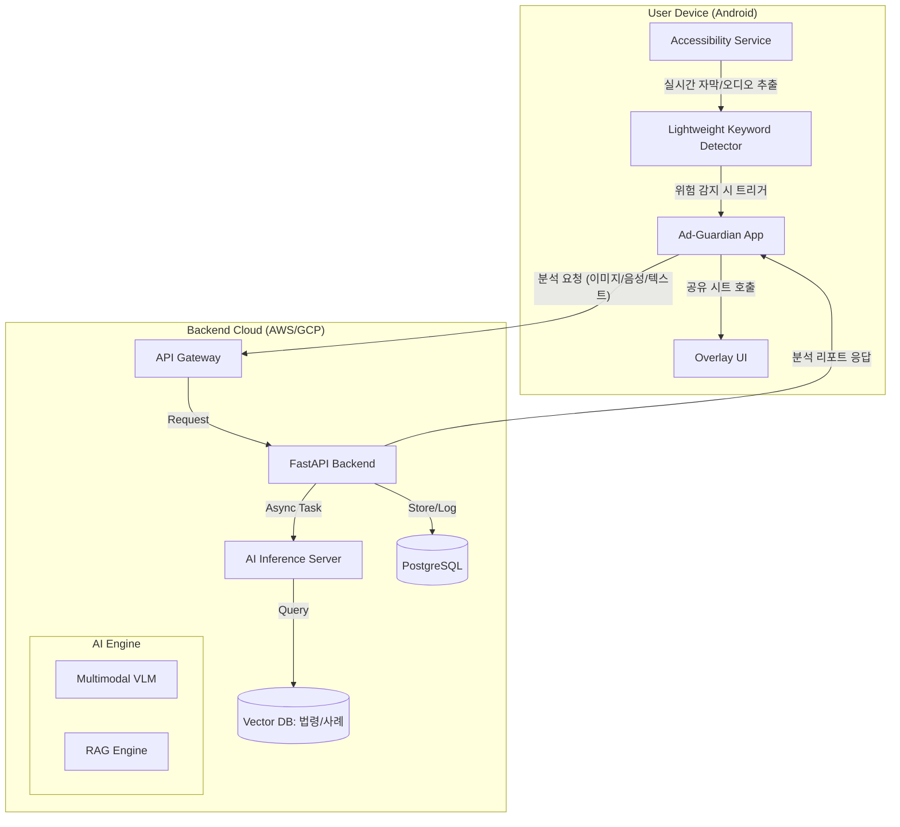

---

# 5. 시스템 구성

> **작성 가이드**: 본 시스템은 모바일 기기에서의 실시간 감지(능동형 호출)와\
>  클라우드 서버의 고성능 AI 분석이 결합된 **Hybrid-Cloud 아키텍처**를 채택한다.

---
## 전체 아키텍쳐 다이어그램 이미지

---
## 5.1 전체 아키텍처 다이어그램

## 5.2 주요 컴포넌트

| 컴포넌트 | 역할 | 기술 후보 |
|---------|------|-----------|
| **Mobile Client** | **능동형 모니터링 수행**. Accessibility Service를 통해 SNS(유튜브 등)의 화면을 읽고 위험 징후를 선제적으로 포착. | Android (Kotlin), Accessibility API |
| **Edge AI (On-device)** | 서버 호출 전, 기기 내에서 1차적인 필터링(키워드/패턴)을 수행하여 배터리 소모 최적화. | TensorFlow Lite, Whisper-tiny |
| **Backend API** | 클라이언트 요청 중계, 사용자 인증, 분석 결과 이력 관리 및 비동기 작업 큐 관리. | **FastAPI** (비동기 처리 효율성), Redis |
| **AI Inference Server** | 고성능 멀티모달 모델(VLM)을 구동하여 딥페이크 판별 및 정밀 분석 수행. | PyTorch, NVIDIA Triton, vLLM |
| **Vector Database** | 최신 식약처·공정위 가이드라인을 벡터화하여 저장하고, 분석 시 실시간으로 관련 법령 인출(RAG). | Pinecone, Milvus, Qdrant |
| **RDBMS** | 사용자 정보, 적발 이력 통계, 서비스 설정 데이터 저장. | PostgreSQL |

## 5.3 데이터 흐름 (Sequence)

### 1) 능동형 호출 (Active Calling) 흐름
1.  **감지**: `Accessibility Service`가 유튜브 쇼츠 시청 중 '알부민' 관련 키워드나 가짜 의사 패턴을 화면/음성에서 포착.
2.  **판단**: `On-device AI`가 1차 위험 점수를 계산, 임계치 초과 시 서버에 정밀 분석 요청.
3.  **알림**: 서버 응답을 바탕으로 사용자 화면에 **오버레이 경고 UI**를 즉시 노출.

### 2) 정밀 검증 (RAG-based Analysis) 흐름
1.  **추출**: 영상 프레임과 오디오 스크립트를 서버로 전송.
2.  **검색**: `RAG Engine`이 벡터 DB에서 해당 상품군(예: 건강기능식품)의 최신 규제 위반 사례를 검색.
3.  **추론**: `VLM`이 영상 맥락과 검색된 법령을 대조하여 최종 위반 여부 판정.
4.  **결과**: 사용자에게 "치료 효과 표방(식약처 규제 위반)" 등의 구체적 근거가 담긴 리포트 제공.

## 5.4 기술적 고려 사항

- **실시간성 (Low Latency)**: 능동형 호출의 즉각적인 경고를 위해 최신 추론 가속기(vLLM 등)를 사용하여 서버 응답 속도를 200ms 이내로 최적화한다.
- **개인정보 보호**: 온디바이스에서 1차 필터링을 수행하여 불필요한 데이터의 서버 전송을 최소화하고, 전송되는 데이터는 익명화 처리를 거친다.
- **확장성**: SNS 플랫폼의 UI 업데이트(예: 인스타그램 레이아웃 변경)에 대응하기 위해, 화면 분석 로직을 서버에서 동적으로 업데이트할 수 있는 구조를 취한다.

---

### [참고 자료: 아키텍처 근거]
* **Android Accessibility Service**: [공식 개발자 문서](https://developer.android.com/guide/topics/ui/accessibility/service) - 능동형 UI 감지를 위한 필수 기술.
* **FastAPI Async**: 비동기 I/O를 통한 대규모 광고 스캐닝 요청 처리 효율성 확보.
* **RAG 기반 법령 매칭**: 식약처/공정위의 방대한 텍스트 데이터를 효율적으로 활용하기 위한 최신 AI 아키텍처 적용.
---
